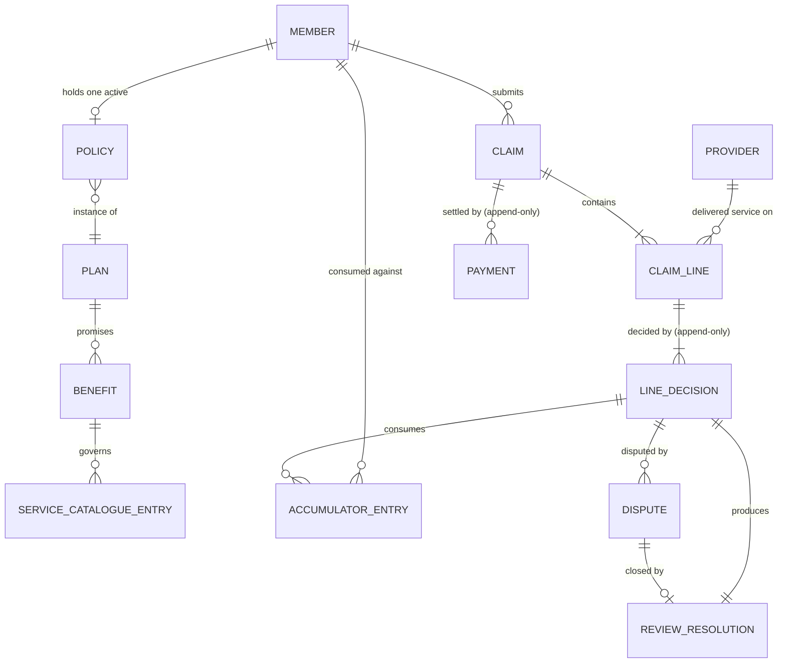
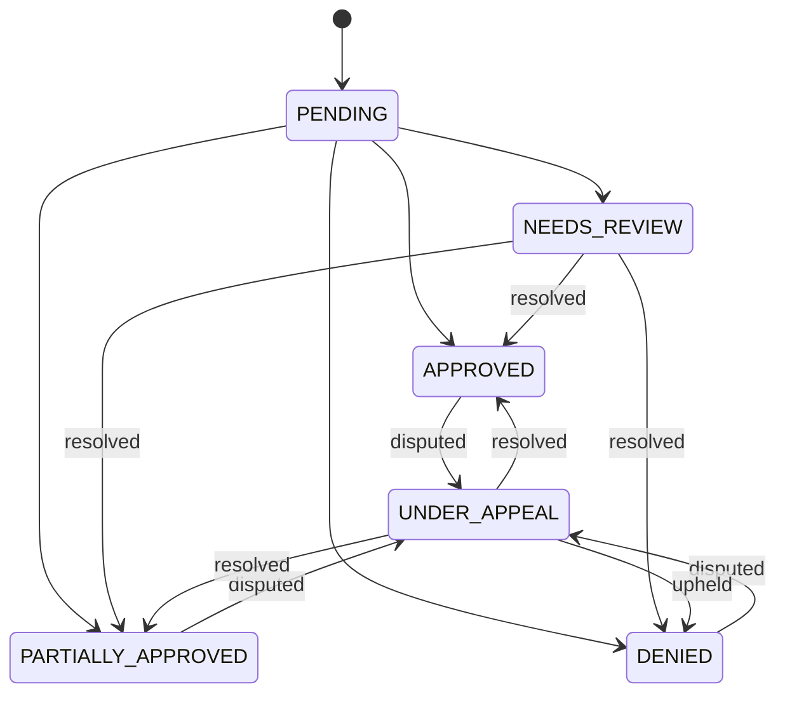
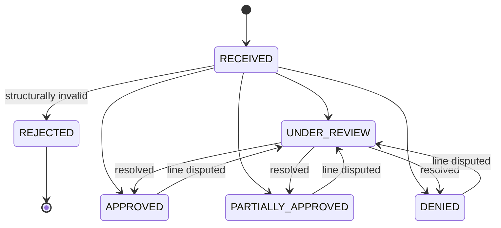

# Domain Model

Entities, relationships, state machines, and why the domain was decomposed this way.

> **Status: written ahead of implementation, and reconciled against the code before submission.**
> It is written now so the model is settled before code exists rather than reverse-engineered from it,
> but a domain model doc that describes a system nobody built is worse than none. Every claim in here
> gets re-verified against `app/` at the end.

---

## 1. The four ideas the model is built on

Everything below follows from four observations about how claims processing actually works. If only
this section is read, these are the load-bearing parts.

**1. The claim is an envelope; the line item is the unit of decision.** Real payers adjudicate line by
line. One claim legitimately ends with three lines paid, one denied, and one awaiting a human. This is
the ordinary shape of the domain, not an edge case — so the model puts decisions on lines and derives
claim-level state from them, never the reverse.

**2. Coverage and payment are different questions.** A line whose entire allowed amount lands on the
member's deductible is *covered* and *paid zero*. Calling that a denial would be wrong on the member's
statement and would wrongly grant appeal rights. So `outcome` (a coverage determination) and the amount
breakdown (who owes what) are separate concepts, and no field conflates them.

**3. Accumulators are the system's memory, and the only state shared between claims.** Every claim for a
member is adjudicated against what previous claims already consumed. Every other entity belongs to
exactly one claim; the accumulator does not. That makes it the single point of contention in the whole
system, which is why it gets a ledger and a lock rather than a counter and hope.

**4. Explanation is an output of adjudication, not a log of it.** The reason a line was denied is
produced at the moment of decision, by the code that made it, and stored with it. Reconstructing it
later would let the explanation drift from what actually happened.

---

## 2. Entities

### 2.1 Party and policy

| Entity | Fields | Notes |
|---|---|---|
| `Member` | `id`, `name`, `date_of_birth` | **Identity only — no clinical data.** Diagnosis codes live on `ClaimLine`. Deliberate: it keeps the join between "who this is" and "what's wrong with them" explicit rather than incidental. |
| `Provider` | `id`, `name` | Deliberately thin. No network status, no contracted rates — every provider is treated identically. |
| `Plan` | `id`, `version`, `deductible`, `benefits[]` | Versioned. **`deductible` is the single source of truth** for the policy-year deductible (D26). The version is stamped onto every decision it produces. |
| `Policy` | `id`, `member_id`, `plan_id`, `effective_date`, `termination_date` | The link between a member and a plan, bounded in time. Eligibility is a date comparison against this. **No deductible field** — that amount lives on `Plan`. |
| `Benefit` | `code`, `covered`, `excluded`, `annual_limit_amount`, `annual_visit_limit` | **A benefit *is* a coverage rule.** See §4. |
| `ServiceCatalogueEntry` | `service_code`, `description`, `benefit_code`, `scheduled_amount` | Maps a billed service to the benefit that governs it, and to the price the plan will allow. |

### 2.2 Claim and decision

| Entity | Fields | Notes |
|---|---|---|
| `Claim` | `id`, `member_id`, `submitted_at`, `lines[]` | The envelope. Both its states are **derived**, never assigned (§3.2). |
| `Payment` | `id`, `claim_id`, `amount`, `paid_at`, `reference` | **Append-only, never negative.** Recording that money moved is not a payment system: there is no gateway, no reconciliation, no reversal. |
| `ClaimLine` | `id`, `claim_id`, `line_number`, `provider_id`, `service_code`, `service_date`, `billed_amount`, `diagnosis_code` | Where clinical data lives. Carries its own `service_date`. |
| `LineDecision` | `id`, `line_id`, `sequence`, `source`, `outcome`, amount breakdown, `reasons[]`, `trace`, `plan_version`, `decided_at`, `decided_by` | **Append-only.** The current decision is the highest `sequence`. Amount breakdown is present only when the decision reached financial adjudication (D27). |
| `ReasonCode` | `code`, `message`, `liability`, `appealable` | Static catalogue, not a table of rows created at runtime. No `HUM_UPHELD` — uphold is not a decision reason (D29). |
| `AccumulatorEntry` | `id`, `key`, `quantity`, `decision_id`, `reverses_entry_id` | **Append-only ledger.** Balance is the sum. |
| `Dispute` | `id`, `line_id`, `disputed_decision_id`, `member_reason`, `state` | Points at the *decision* disputed, not just the line — so it remains meaningful after later decisions supersede it. |
| `ReviewResolution` | `id`, `line_id`, `dispute_id?`, `mode`, `reviewer_id`, `note`, `corrections`, `resulting_decision_id` | The only exit from `NEEDS_REVIEW` or `UNDER_APPEAL`. `mode=uphold` is **dispute-only** (D28) and is recorded here; the resulting `LineDecision` keeps the RULES reason code (D29). |

**Two fields carry unusual weight.**

`LineDecision.source` is `RULES` for every monetary outcome in this implementation. Manual
computed-value overrides (`HUMAN_OVERRIDE`) are deferred (D21). Reviewer actions are recorded in
`ReviewResolution` (fact corrections, or uphold on a dispute). The engine still produces all amounts
and reason codes — including after uphold, which keeps the original RULES reason (e.g. `DEN_EXCLUDED`)
rather than introducing a human-uphold code (D29).

`ClaimLine.service_date` sits on the line, not the claim. Real claims span dates; eligibility is judged
per service date; accumulators are keyed by plan year. With the date on the line, a claim crossing a
plan-year boundary needs no special case — each line simply resolves its own plan year.

### 2.3 Relationships



### 2.4 Aggregates and the one thing outside them

The **claim aggregate** is `Claim` + its `ClaimLine`s + their `LineDecision`s. It is a consistency
boundary: claim state is recomputed from line states within it, and nothing outside reaches in.

**Accumulators sit deliberately outside.** They belong to a *member*, span every claim that member ever
files, and are read and written during adjudication of each one. Naming this explicitly matters, because
it identifies exactly where the system can go wrong: it is the only mutable state two claims can fight
over, and therefore the only place needing a lock, an invariant, and a ledger. Everything else in the
model can be reasoned about one claim at a time.

---

## 3. State machines

### 3.1 Line item — where decisions actually happen



| Outcome | Means |
|---|---|
| `APPROVED` | The whole allowed amount was covered — **even if the plan paid zero** because it all went to the deductible |
| `PARTIALLY_APPROVED` | Some of the allowed amount was covered, some denied (the annual-limit boundary) |
| `DENIED` | None of it was covered |
| `NEEDS_REVIEW` | The rules could not decide confidently — a designed outcome, not a failure |

Every transition out of `NEEDS_REVIEW` or `UNDER_APPEAL` triggers **whole-claim re-adjudication** (D16)
and appends new `LineDecision` records where lines are re-evaluated (D24). Earlier decisions are never
edited or deleted. **`NEEDS_REVIEW` and `UNDER_APPEAL` lines post no ledger entries** — including after
re-adjudication that leaves them still in review. **Terminal** lines post when their decision becomes
current (initial submit or after resolution). Re-adjudication reverses superseded terminal entries and
posts new terminal entries atomically (D16, D19).

**Iterative resolution (D23):** review resolution may be attempted multiple times via the same endpoint
until terminal outcomes are reached. A line that **remains** `NEEDS_REVIEW` after correction still
receives a **new** `LineDecision` with updated reason, trace, and inputs — not an in-place update.

**No permanent close without rules (D25):** there is no in-scope action to mark a review "permanently
undecidable." The claim stays `UNDER_REVIEW` until facts yield a terminal rules outcome or a dispute is
upheld. Closing unresolved reviews is future work. **Uphold is dispute-only** (D28): a `NEEDS_REVIEW`
line with no dispute cannot be closed by uphold. When a dispute is upheld, `ReviewResolution` records
the uphold; the appended `LineDecision` keeps the RULES reason code (D29).

### 3.2 A claim has two lifecycles, not one

The problem statement sketches a single chain: `submitted → under review → approved/denied → paid`.
Modelling it that way produces a contradiction that only appears once disputes are taken seriously.

**The contradiction.** `PAID` is terminal and money only moves forward — no clawbacks. But a member can
dispute a *denied* line on a claim that has already been paid for its *approved* lines, which is the
common case in practice rather than an exotic one. If that dispute succeeds, the plan owes more money on
a claim sitting in a terminal state.

The resolution is that the single chain conflates two independent questions:

- **What did we decide?** — an adjudication question, answered by the lines
- **What have we paid?** — a settlement question, answered by payment records

They move at different speeds and for different reasons, so they are **separate derived fields**. Neither
is ever assigned directly; both are recomputed from append-only underlying data.

#### Adjudication state — derived from line states



| Condition | Adjudication state |
|---|---|
| Structural validation failed | `REJECTED` (terminal — never adjudicated) |
| Any line `NEEDS_REVIEW` or `UNDER_APPEAL` | `UNDER_REVIEW` |
| All lines `DENIED` | `DENIED` |
| All lines `APPROVED` | `APPROVED` |
| Otherwise | `PARTIALLY_APPROVED` |

**`REJECTED` and `DENIED` are different on purpose.** Rejected means the claim was never adjudicated
because it was incoherent. Denied means it *was* adjudicated and the answer was no. A member can dispute
a denial; there is nothing to dispute about a malformed submission.

**Returning to `UNDER_REVIEW` is not a backwards transition.** The state is a *current summary* of the
lines, recomputed on demand — not a decision being unmade. A settled claim with a reopened line genuinely
is under review again.

#### Settlement state — derived from payments against what is owed

`Payment` records are append-only and never negative. Let `payable` be the sum of `plan_paid` across each
line's *current* decision **that has a financial breakdown**, and `paid` the sum of payments recorded
against the claim. Pre-pricing decisions (`REJECTED`, `NEEDS_REVIEW`, early-gate denials) have no
`plan_paid` and contribute zero (D27).

| Condition | Settlement state |
|---|---|
| `payable == 0` | `NOTHING_DUE` |
| `paid < payable` | `DUE` |
| `paid == payable` | `SETTLED` |
| `paid > payable` | `OVERPAID` |

A payment may only be recorded when adjudication state is `APPROVED` or `PARTIALLY_APPROVED` and
settlement state is `DUE`. We never pay a claim that is still under review.

**`OVERPAID` is an anomaly the system surfaces rather than corrects.** It arises if an appeal reduces an
already-paid amount. With no clawbacks, the system's job is to make the discrepancy visible — the same
detect-and-surface stance taken everywhere the correct action requires human judgement.

#### Why this is better than a single chain

Walk the awkward case through both fields and it stops being awkward. A claim is partially approved and
settled; the member disputes the denied line. Adjudication returns to `UNDER_REVIEW` while settlement
stays `SETTLED`, because nothing about what we paid has changed. The appeal is overturned, `payable`
rises, and settlement becomes `DUE` on its own — no special case, no exit from a terminal state, no
reversal. A supplementary payment is just another payment record.

Both fields are derived from append-only data, so neither can drift from the facts underneath it.

The cost is one extra concept and a departure from the chain the problem statement sketched. Worth it:
the single chain does not survive contact with post-payment disputes.

---

## 4. How coverage rules are represented

**A `Benefit` is the rule.** A plan's promise about a category of service, expressed as typed data:

```python
@dataclass(frozen=True)
class Benefit:
    code: str                          # "PHYSIO"
    covered: bool                      # is this a listed benefit?
    excluded: bool                     # is it explicitly excluded?
    annual_limit_amount: Money | None  # cap on what the plan pays per year
    annual_visit_limit: int | None     # cap on occurrences per year
```

Rules are **typed objects seeded from data**. Adding a plan is a data change. Adding a new *kind* of
rule is a code change — which is honest, because a new rule shape needs new pipeline logic and new tests
regardless of how it is stored. Pretending otherwise is what turns a rules engine into a DSL nobody can
debug.

`covered` and `excluded` are separate rather than one tri-state because they produce different reason
codes with different appeal rights. "Not a listed benefit under your plan" and "explicitly excluded by
your plan" are different conversations with a member, and collapsing them would lose that.

### 4.1 Applying them: the adjudication pipeline

Per line, in order. The first gate that terminates wins.

| # | Gate | Failure |
|---|---|---|
| 0 | Claim structurally valid *(claim-level)* | `REJECTED` |
| 1 | Service code exists in the catalogue | `NEEDS_REVIEW` |
| 2 | Not a **confirmed** duplicate (exact repeat within this claim) | `DENIED` |
| 3 | Not a **suspected** duplicate (matches a previously adjudicated line) | `NEEDS_REVIEW` |
| 4 | Policy active on the line's service date | `DENIED` |
| 5 | Benefit is covered by the plan | `DENIED` |
| 6 | Benefit not explicitly excluded | `DENIED` |
| 7 | Priced: `allowed = min(billed, scheduled_amount)` | `NEEDS_REVIEW` if unpriceable |
| 8 | Within the annual visit limit | `DENIED` |
| 9 | Deductible, then annual dollar limit | may be partial |

Cheap deterministic checks come before expensive arithmetic, mirroring how real adjudication sequences
administrative validation before eligibility before pricing. We never compute money for a claim that was
never going to pay.

**Confirmed vs suspected duplicates** are deliberately different. A repeat within one claim is a data
error the system can rule on alone. The same match *across* claims on
`member_id + provider_id + service_code + service_date` (billed amount excluded) may be legitimate
repeated care, so it becomes `NEEDS_REVIEW` rather than auto-denial (D8, D17). Unresolved
`NEEDS_REVIEW` lines are not used as duplicate anchors.

### 4.2 The arithmetic

```
allowed            = min(billed, scheduled_amount)
above_allowed      = billed - allowed                       → member owes
deductible_applied = min(allowed, deductible_remaining)     → member owes
after_deductible   = allowed - deductible_applied
plan_paid          = min(after_deductible, limit_remaining) → plan pays
denied_amount      = after_deductible - plan_paid           → member owes
```

The annual dollar limit caps **plan payment**, not allowed amount: a benefit maximum limits the
insurer's exposure, and the deductible is the member's own money. The deductible is **policy-wide** for
the plan year, shared across benefits — so a physio claim consumes the deductible that then changes the
outcome of a later diagnostics claim. The deductible **amount** is `Plan.deductible` (D26).

Because line items have no `units`, every amount is produced by addition, subtraction, or `min` on
integers. **There is no division and no rounding anywhere in the system.**

---

## 5. Accumulators

```python
@dataclass(frozen=True)
class AccumulatorKey:
    member_id: str
    plan_year: int
    scope: Scope              # DEDUCTIBLE | BENEFIT_AMOUNT | BENEFIT_VISITS
    benefit_code: str | None
```

An accumulator is **a quantity measured against a limit** — where the quantity is money for deductibles
and dollar caps, and a count for visit caps. One abstraction, three uses. Building it as a money counter
and adding visit counts afterwards would be the one genuinely expensive retrofit in this model.

Balance is the **sum of an append-only ledger**, not a mutable counter. Every entry names the decision
that caused it; reversing an entry means posting a compensating one. Three things fall out of that: an
overturned appeal reverses cleanly instead of via a read-modify-write that can double-apply, the
before/after values the explanation needs exist by construction, and the financial record is as immutable
as the decision record it accompanies.

### 5.1 A limit can be overspent two different ways

They look unrelated and have different fixes, but they are the same mistake: **treating a balance that
is being consumed as though it were a constant.**

**Within one claim.** Two ₹4,000 lines against ₹2,000 remaining. If each line is evaluated against the
same untouched snapshot, both pay ₹2,000. The engine therefore threads a **working balance** through the
lines in `line_number` order — the snapshot is a starting point, not a constant. No database involved;
this is a single-threaded bug.

**Across concurrent claims.** Two claims adjudicating simultaneously both read ₹8,000 consumed and both
pay ₹2,000. Prevented by taking the write lock *before* reading balances, plus an invariant checked
before commit that refuses to persist any decision that would push a balance past its limit. Details in
`technical-plan.md` §4.1.

---

## 6. Explanation

Every decision carries reason codes and a trace, produced by the engine at decision time.

A `ReasonCode` carries three things beyond its message: **who absorbs the amount** (member or plan),
**whether it is appealable**, and its category. "Applied to your deductible" assigns cost to the member
but is not a denial and cannot be appealed; "annual benefit maximum reached" assigns cost to the member,
*is* a denial, and can be. The appealable flag is what lets a dispute against a deductible be refused
with a real explanation rather than a validation error.

The **trace** is the evidence beneath the sentence — one entry per gate evaluated, naming the rule, its
inputs, its result, and the accumulator balance before and after:

```json
{ "step": "annual_dollar_limit", "rule": "BENEFIT.PHYSIO.annual_limit_amount",
  "plan_version": 3, "inputs": {"after_deductible": 40000, "limit_remaining": 10000},
  "result": "partial", "accumulator_before": 90000, "accumulator_after": 100000 }
```

---

## 7. Invariants

Properties that must hold after every operation. Several are enforced as tests, one as a pre-commit
check.

1. **Money conservation.** `billed == above_allowed + deductible_applied + plan_paid + denied_amount`
   for every decision that reached pricing / financial adjudication. Pre-pricing exits have no amount
   breakdown (D27). Adjudication never creates or destroys money; it only assigns it to a party.
   *(property test on priced decisions)*
2. **No accumulator exceeds its limit.** *(checked before commit; violation aborts and routes to review)*
3. **Decisions are append-only**, and exactly one is current per line — the highest `sequence`.
4. **Both claim states equal their derivations** in §3.2. Neither is ever assigned directly.
4b. **Payments are append-only and non-negative**, so `paid` never decreases. `OVERPAID` is therefore
   always the result of `payable` falling, never of money being taken back.
4c. **`NEEDS_REVIEW` / `UNDER_APPEAL` lines post no ledger entries** (D16). Terminal lines post when
current. Re-adjudication: reverse superseded terminal entries, post new terminal entries atomically (D19).
4d. **Payments must equal payable exactly** (D20).
5. **Every decision carries at least one reason code.** A decision without an explanation is a bug.
6. **Every accumulator entry references the decision that caused it.** No orphan consumption.
7. **A dispute may only target a reason marked appealable.**
8. **Determinism:** identical inputs produce identical decisions and traces. *(test)*
9. **Re-adjudication uses the original `plan_version`** unless a deferred retroactive workflow explicitly
   applies a different version (D18).

---

## 8. Why this decomposition

Alternatives that were considered and rejected. The rejections carry more information than the choices.

| Alternative | Why not |
|---|---|
| **One decision per claim** | Contradicts how adjudication works. Partial approval — some lines paid, some denied, one in review — is the ordinary case, and a claim-level decision cannot express it without inventing a summary that loses the reasons. |
| **Mutable decisions, updated on appeal** | Destroys the audit trail. "The original decision stands, the appeal is separate" becomes unenforceable, and there is no way to show what a member was originally told. |
| **Claim state assigned directly** | Two sources of truth for one fact. Every line-level event would have to remember to update the claim, and the day one forgets, the claim's state silently contradicts its own lines. Deriving it makes that impossible. |
| **`outcome` merged with payment amount** | Would classify a fully-deductible line as denied — wrong in the domain, wrong on the member's statement, and it would wrongly grant appeal rights. This is the single most important separation in the model. |
| **Accumulator as a mutable counter** | Cheaper, but reversal on appeal becomes a read-modify-write that can drift or double-apply, and the before/after values the explanation needs must be captured by hand. The ledger makes both structural. |
| **Dispute as a claim state** | A dispute has its own data — who filed it, when, why, what was decided — and its own lifecycle. Flattening it into a state field would lose all of it. |
| **`units` on line items** | Would force proportional splitting when a visit limit allows 2 of 5 units, introducing division, rounding, and a rounding policy to defend. Three sessions are three lines; the domain coverage is identical and the arithmetic risk disappears. |
| **Coverage rules as a DSL or free-form expressions** | More impressive-looking, less defensible. Typed objects seeded from data give the same "new plan = new data" property, and can be walked through under pressure without a parser. |
| **Service date on the claim** | Would need a special case for claims spanning a plan-year boundary, or would quietly get it wrong. On the line, it needs neither. |
| **A single claim lifecycle ending in `PAID`** | The chain the problem statement sketches, and it breaks on the ordinary case of a member disputing a denied line after the claim was paid: the plan then owes more on a claim in a terminal state. Separating adjudication from settlement (§3.2) makes that case fall out with no special handling. |

---

## 9. Vocabulary

Terms are used in the code exactly as they are used here.

| Term | Meaning |
|---|---|
| **Billed amount** | What the member paid and is claiming |
| **Allowed amount** | What the plan recognises for that service — the basis for all cost-sharing |
| **Above allowed** | Billed minus allowed. **In a reimbursement model this is the member's cost**, not a provider write-off, because there is no provider contract to absorb it |
| **Deductible** | What the member pays before the plan starts paying, policy-wide per plan year |
| **Accumulator** | Running total of a quantity consumed against a limit, per member, benefit and plan year |
| **Adjudication** | Applying coverage rules to a line item to produce a payable amount and a reason |
| **Confirmed duplicate** | An exact repeat within one claim — a fact the system can assert |
| **Suspected duplicate** | A match across claims — a question the system raises for a human |
| **Plan year** | Calendar year |
